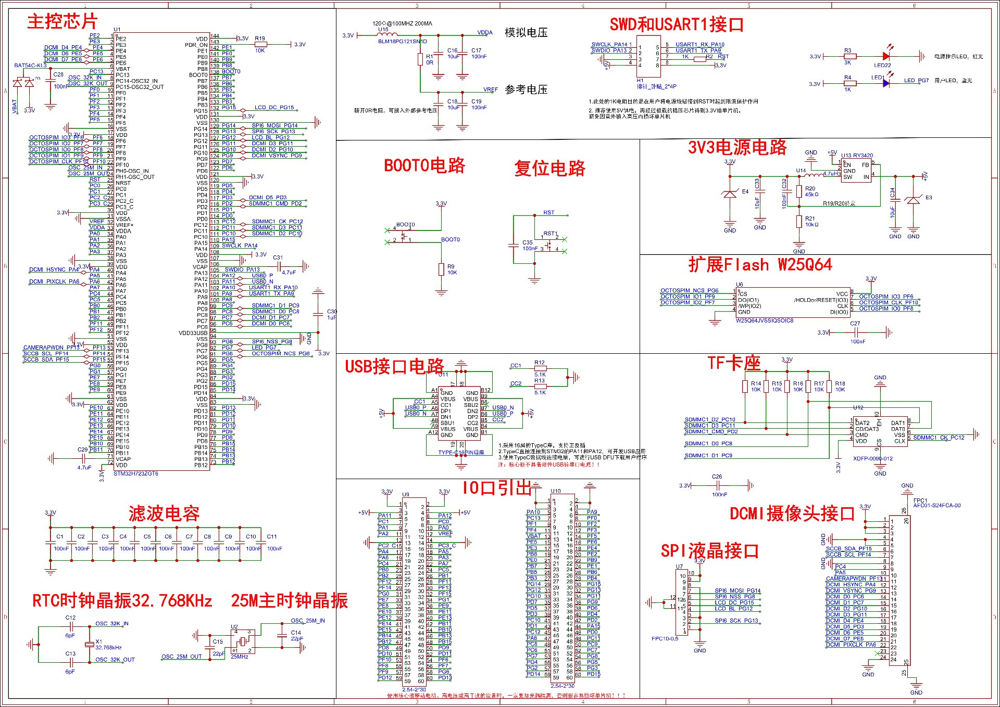

# 从零跑通 —— 源代码 / 构建 / 烧录 / 复现实验

> 这份文档写给**第一次拿到本仓库的人**。目标：在 **30 分钟内**从克隆跑到
> "板子上跑起 100 µs 硬拍 + 部署一个控制程序"，并且知道**每条结论该用哪个脚本自己复现**。
>
> ★ 本项目的所有结论都以「**你能自己跑出来**」为前提撰写 —— **不能复跑的结论不写**。

---

## 0. 你需要什么

| 项 | 型号 / 备注 |
|---|---|
| **开发板** | 鹿小班 **LXB723ZG-P1**（STM32H723ZGT6，1MB Flash）—— 原理图见 [§6](#6-硬件参考原理图) |
| **调试器** | DAPLink（CMSIS-DAP）—— 烧录 + 无串口调试 |
| **USB-TTL** | CH340 / CH343 —— 协议口（USART1，PA9/PA10） |
| 逻辑分析仪 | Saleae Logic2（**可选，但强烈建议**）—— 时序结论的外部证据来源 |
| 主机 | Windows + Git Bash（构建脚本是 bash） |

**接线**（两根 USB 线即可，串口只需 3 根）：
```
DAPLink  ──USB── PC          # 烧录 + SWD
CH340 : RXD → 板 H1 pin6 (PA9=TXD)
        TXD → 板 H1 pin5 (PA10=RXD)
        GND → 板 GND          # ★ 必须共地
```

---

## 1. 源代码在什么地方

```
src/                  平台与引擎（42 个 .c/.h，约 14k 行）
  clock.c/h           ★ 时钟树：HSE25 → VOS0 → PLL1 = 400MHz（全整数链）
  regs.h              H723 寄存器定义（自写，不依赖 CMSIS）
  engine.c/h          ★ 引擎核心：SHM 布局 / 冷启动清零 / 扫描 / 分发
                        （engine.h 里同时是"表结构 + SHM 偏移 + 原语码"的唯一真值源）
  primitives.h        19 个原语实现
  main.c              ★ 100µs 硬拍 ISR + 协议分发 + 观测面 + 分组统计
  transport.c/h       帧协议（SYNC/CMD/LEN/PAYLOAD/CRC16）
  uart.c/h            USART1 驱动（PA9/PA10，AF7）
  adc.c / di.c / do.c / hil.c / rtc.c / sd.c      各外设域
  modbus.c            通信域：Modbus RTU 从站
  macro.c             W5：macro 字节码 VM
  persist.c           掉电保持（★ 见 §7 平台限制）
  wdt.h               独立看门狗 + 落盘窗口
  faultlog.h          故障台账（24 类 + 首例现场）
ld/                   链接脚本（ITCM/DTCM 布局 + 溢出断言）
startup/              ST 启动文件（含 ITCM 拷贝循环）
cmake/                工具链文件（★ 改编译器路径只改这里）
tools/                ★ 60 个 Python 工具：验收 / 复现 / 诊断 / 组态
docs/                 设计文档 + 4 轮外部审计（含失败记录）
examples/             .dcl 组态示例（顺序域 / 逻辑 / PID / DI）
```

---

## 2. 构建产物在什么地方

**构建一次就有了**（`build/` 目录**不入版本控制**）：

| 文件 | 用途 |
|---|---|
| `build/dcl_h723` | **ELF**（无扩展名）—— 给调试器/`nm`/`objdump` 用 |
| `build/dcl_h723.hex` | **Intel HEX** —— **烧录用这个** |
| `build/dcl_h723.bin` | 裸二进制 |
| `build/dcl_h723.map` | 链接映射 —— 查符号地址（工具都从这里取地址，**不硬编码**）|

---

## 3. 工具链（本项目实际使用的）

| 工具 | 版本 | 用途 |
|---|---|---|
| **arm-none-eabi-gcc** | 7.3.1 | 编译（STM32CubeIDE 自带） |
| cmake | 4.0.3 | 构建系统 |
| ninja | 1.12.1 | 构建执行 |
| **pyocd** | 0.44.1 | 烧录 + 内存读写（**目标名必须是 `stm32h723xx`**）|
| python 3.x + pyserial | — | 跑验收脚本 |

⚠️ **注意（移植时要改）**：`build.sh` 与 `cmake/arm-none-eabi.cmake` 里的工具路径目前指向
本机安装位置（cmake/ninja 来自 `C:/Espressif/tools/`，gcc 来自 STM32CubeIDE）。
**换机器只需改这两处**，命令行不用动。

---

## 4. 构建 + 烧录（4 条命令）

```bash
# ① 构建（含"零警告"硬闸门 + ISR 落位闸门，任一不过就构建失败）
bash build.sh

# ② 烧录
pyocd flash -t stm32h723xx -O connect_mode=under-reset build/dcl_h723.hex

# ③ 放核运行（★ pyocd 烧完会把核留在 HALT，必须显式放）
pyocd cmd -t stm32h723xx -O connect_mode=under-reset -c reset -c go

# ④ 探活：协议层 12 个用例
python tools/h723_proto.py --port COMxx      # COM 口按实际填
```

**预期输出**：
- ① 末尾打印 `✓ 零警告` + ISR 落位闸门 `违规 0` + 生效开关表
- ② 必须出现 `programmed N bytes`（**N>0**）—— 见 §7 坑 #1
- ④ `12 PASS / 0 FAIL / 0 SKIP`

---

## 5. 跑通第一个程序（部署 + 启动）

引擎固件一次烧录后，**控制逻辑可以反复下发覆盖**（不用重烧）：

```bash
# 用组态编译器编一个示例程序
python tools/dclc.py examples/h723_seq_demo.dcl -o build/seq.bin

# 端到端跑一遍（编译 → 下发 → 启动 → 读回验证）
python tools/h723_demo_e2e.py --port COMxx
# 预期：20 PASS / 0 FAIL / 1 SKIP（连跑 3 次一致）
```

★ 端到端演示的三域覆盖：**顺序域**（步号/停留时间实测）、**逻辑+标准块**（15 条期望值逐条命中）、
**PID**（上升速率实测 24.99/s vs 理论 25.0）。

---

## 6. 硬件参考（原理图）



**关键引脚**（逐脚核对过，详见 [`HARDWARE-PINOUT.md`](HARDWARE-PINOUT.md)）：

| 功能 | 引脚 | 备注 |
|---|---|---|
| 协议口 | **PA9 / PA10**（USART1，AF7） | 引到 H1 排针 pin6/pin5 |
| 485 / Modbus | **PA2 / PA3**（USART2） | ★ **3.3V 域，别接 5V 收发器** |
| **AI 模拟输入** | **PA0 / PA1 / PA4**（ADC1_INP16/17/18） | 排针 **U9 pin10 / pin9 / pin17** |
| HIL PWM / 反馈 | PA6（TIM3_CH1）/ PA5（ADC_INP19） | |
| DI / DO | PC0~PC3 / PE0~PE15 | |
| SD 卡 | PC8~PC12（SDMMC1） | 黑匣子日志（裸块）|
| 心跳 | **PB0（ISR）/ PB1（主循环）** | 接 LA 可直接看拍活不活 |
| 拍输出 | **PA8** | LA 测拍频率用 |
| ★ 注意 | **PA4= DCMI_HSYNC / PA6 = DCMI_PIXCLK** | 官方网络名；板上摄像头座可能挂器件 |
| ★ 千万 | **不要接 +5V 到 AI 脚** | 模拟模式无 5V 容忍 |

---

## 7. 常见坑（都是踩过的，先看再动手）

1. **`pyocd flash` 报 `identical N bytes` = 烧的是旧产物** ⇒ 说明**构建失败了**（构建失败时 pyocd 会静默跳过烧录）。
   先回去看 ① 的输出。
2. **`pyocd flash` 之后必须 `-c reset -c go`** —— 否则核停在 HALT，串口"完全没响应"，
   看起来像"固件死了"。
3. **读运行期状态别用会复位的工具** —— `connect_mode=under-reset` 不带 `-c reset` 会读回**陈旧内存**；
   要读运行期计数用 `connect_mode=halt`（挂核不复位）。
4. **`pyocd` 会话会静默停掉 `DWT_CYCCNT`** ⇒ 之后所有 DWT 计时统计**静默读 0**。
   判据：先读 `g_per_glitch_n`，**必须为 0**，否则拒答。
5. **CMake 的 `-D` 是缓存的** —— 上轮传过 `-DDCL_XXX=0`，这轮不传**不会**回到默认值。
   `build.sh` 每次都显式传全量默认值来覆盖缓存（新增开关时要同步加进去）。
6. **`--gc-sections` 会回收没人读的全局**（`volatile` 也保不住）⇒ 观测变量必须在代码里**真读或真写**一次。
7. **串口找错口**：`find_port()` 只按 VID `1A86` 匹配，而 CH340 和 CH343 都是 `1A86`
   ⇒ **跑套件请显式传 `--port COMxx`**。

---

## 8. 实验复现：每条结论对应的命令

> 原则：**能复跑的才有资格写进指标表**。下表每一条都能独立执行。

### 8.1 时序 / 确定性

| 结论 | 复现命令 | 判据 |
|---|---|---|
| 拍周期 = **100.0000 µs** | `python la_tick_freq.py --cpu 400 --ch 4` | 边沿间隔**众数 96% 命中**（需 LA 接 CH4←PA8）|
| 拍抖动 **min = max = 40000 cyc** | `python tools/h723_stage1_read.py --run 3` | DWT 读回，经 LA 标定 |
| ISR 入口间隔 + 超预算 | `python tools/h723_jitter.py` | 9/9（★ 口径：测的是**ISR 入口**，不是拍长抖动）|
| 擦除期间丢拍（**A/B 对照**）| `bash build.sh -DDCL_VTOR_ITCM=0` → 烧录 → `python tools/h723_tick_erase.py` | **应报缺口**（对照：8153 拍）|
| 同上，交付档 | `bash build.sh` → 烧录 → 同上 | **应报 0** |

### 8.2 引擎成本 / 落位

| 结论 | 复现命令 | 判据 |
|---|---|---|
| 单条路由 **56.0 cyc** | `python tools/h723_op_sweep.py --dur 0.3 --json build/op_cost.json` | **19/19 可信**（工具已修"整程没有 go"的缺陷）|
| ITCM vs FLASH（**同镜像 A/B**）| `python tools/h723_stage2_read.py --dur 0.7` | 完整矩阵（约 40s）|
| 落位机制（地址 mod 32）| `python tools/h723_pad_sweep.py` | 8 个同余类各双样本一致 |
| **ISR 可达却留在 flash**（构建期闸门）| `python tools/gate_isr_itcm.py build/dcl_h723` | **违规 0**（已在 `build.sh` 里自动跑）|
| 容量：门上限 471 条 | `python tools/h723_capacity.py` | 8/8 |

### 8.3 协议 / 域功能

| 结论 | 复现命令 | 判据 |
|---|---|---|
| 协议层 | `python tools/h723_proto.py --port COMxx` | **12/12** |
| 运行控制 + SHM 读写 | `python tools/h723_w1.py --port COMxx` | 28/28 |
| 顺序域 | `python tools/h723_seq.py --port COMxx` | 27/27 |
| Modbus RTU | `python tools/h723_modbus.py --port COMxx` | 15/15 |
| macro VM | `python tools/h723_macro.py --port COMxx` | 18/18 |
| 外设域（DI/AI/HIL）| `python tools/h723_w5.py --port COMxx` | 18/18 |
| 端到端三域 demo | `python tools/h723_demo_e2e.py --port COMxx` | 20 PASS（连跑 3 次一致）|
| 外部审计 M2/M3/M4+P3 | `python tools/h723_audit_m234.py` | 12/12 |

### 8.4 异常路径（★ 本项目最薄弱处的补强）

| 结论 | 复现命令 | 判据 |
|---|---|---|
| 故障台账 + 注入矩阵 | `python tools/fault_suite.py --inject` | 9/9（含**反向判据**：不该涨的分类不许涨）|
| 长稳 | `python tools/fault_suite.py --soak 2` | 全 PASS（★ 只跑了 2 分钟，**应 ≥8h**）|
| 看门狗真的会复位 | `bash build.sh -DDCL_WDT=0/1` 两档对照 | 对照档**不复位** ⇒ 判据能失败 |
| 停机安全态覆盖 HIL | `bash build.sh -DDCL_HIL_SAFE=0` → `python tools/h723_w5.py` | 对照档 H-2b/H-2d **应 FAIL** |

### 8.5 外围（AI / 掉电保持）

| 结论 | 复现命令 | 判据 |
|---|---|---|
| AI 能读（16bit 全量程）| `python tools/h723_adc_live.py COMxx` | 电位器两端点 **0 / 65535** |
| AI 噪声 / ENOB | `python tools/h723_adc_quality.py COMxx --ch 16 --sec 60` | σ≈17.6 LSB / ENOB≈10.1 位（★ 工作点要在**非端点**）|
| 落盘窗口（协议侧）| `python tools/h723_persist_win.py COMxx` | P1~P5 全绿；`-DDCL_WDT_PERSIST_WINDOW=0` 可打 FAIL |
| 引脚接线自检 | 发协议帧 `0x36` | **接了 GND ⇒ 上拉/下拉都 ≈0**；悬空 ⇒ 有差异 |

---

## 9. 证据纪律（为什么这些数字可信）

1. **判据必须能失败** —— 任何"恒真"的判据等于没有判据。
2. **仪器自己也要先被证明** —— ISR 落位闸门曾因 6 个自身 bug **报"无违规"**，
   修掉后同一 ELF 立刻报出 **8 处违规**。**仪器报"通过"不等于它检查过。**
3. **每个特性都要有"改前行为"的对照档** —— 只跑交付档看到 PASS 不构成证据。
4. **时序结论必须有外部仪器**，且**未实测的量不进指标表**。

完整的失败记录与作废结论在 [`docs/audit/`](audit/) —— 那是本仓库最诚实的部分。

---

## 10. 想知道"设计为什么这么做"

| 想了解 | 看这里 |
|---|---|
| 架构总览 / 改代码前必读 | [`ARCH-H723.md`](ARCH-H723.md)（§12 是改动检查清单）|
| 引擎数据流 / 四域 | [`CORE-ENGINE.md`](CORE-ENGINE.md) · [`ARCH-engine-datalink.md`](ARCH-engine-datalink.md) |
| 内存布局 / SHM 偏移 | [`MEMORY-LAYOUT.md`](MEMORY-LAYOUT.md) |
| 硬件引脚 | [`HARDWARE-PINOUT.md`](HARDWARE-PINOUT.md) |
| 阶段 2 规划（硬件选型）| [`PLAN-P2-hardware.md`](PLAN-P2-hardware.md) |
| 四轮外部审计 | [`audit/`](audit/) |
